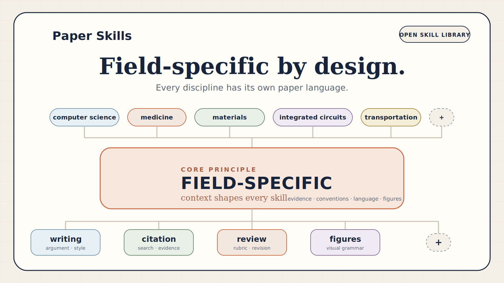

# Paper Skills

**Journal-ready AI skills for every research discipline.**
**面向论文产出的 AI skill 库：写作、引用、审稿、返修、期刊规范与科研图。**



## English

Paper Skills is an open skill library for research-paper workflows. It curates
strong public academic skills and adds first-party work where research papers
still need domain taste: scientific figures, discipline-specific paper
language, and tedious publication workflows.

### Thesis

Every discipline has its own research-paper language. That language includes
prose, evidence, citations, review expectations, venue conventions, and
figures.

Paper Skills turns those conventions into agent-readable skills.

### Skill Areas

| Area | Goal | Status |
| --- | --- | --- |
| `writing` | Polish, translate, restructure, and strengthen manuscript arguments. | placeholder |
| `citation` | Search, verify, audit, and export references. | placeholder |
| `review` | Simulate reviewers, draft rebuttals, QA revisions, and manage response letters. | placeholder |
| `venue-packs` | Capture journal-, conference-, and discipline-specific expectations. | placeholder |
| `plot` | Generate editable, discipline-aware scientific figures. | seed |

### Field-Specific Figures: `plot`

`skills/plot` is for field-specific scientific figures. It invites the
community to build figure skills for different disciplines.

Initial cases:

- **Integrated circuits**: transistor-level analog schematic illustrations from
  netlists, EDA screenshots, paper text, sketches, and component tables.
- **Computer science**: system diagrams, model architecture figures, pipelines,
  dataflow diagrams, and benchmark/evaluation setup figures.

Planned community directions:

- materials science;
- medicine and biomedicine;
- traffic and transportation;
- integrated circuits;
- computer science;
- biology;
- finance.

The goal is not generic prettiness. The goal is for domain experts to say:
this looks like a figure from our field.

### Repository Layout

```text
skills/
  plot/
    domains/
      integrated-circuits/
      computer-science/
  writing/
  citation/
  review/
  venue-packs/
docs/
  academic-skill-pack-survey.md
integrations/
  catalog.md
registry.yaml
```

### Status

Draft scaffold. APIs, install flow, and copied integrations are not stable yet.

### Acknowledgements

Paper Skills is studying and learning from existing academic-skill projects,
including `nature-skills`, `academic-research-skills`, `AI-Research-SKILLs`,
`claude-scholar`, `science-skills`, `Awesome-Journal-Skills`,
`Nature-Paper-Skills`, and `SciAgent-Skills`.

See [ACKNOWLEDGEMENTS.md](ACKNOWLEDGEMENTS.md). Future integrations will follow
upstream licenses and attribution requirements.

## 中文

Paper Skills 是一个面向科研论文产出的开源 skill 库。它不是只做画图，也不是只做润色，而是覆盖论文生产中最繁琐、最容易反复返工的环节：写作、引用、审稿、返修、期刊规范和科研图。

### 核心判断

每个学科都有自己的论文表达语言。

这种语言不只包括英文句子，还包括：

- 论证结构；
- 证据组织；
- 引用习惯；
- 审稿标准；
- 期刊和会议规范；
- 科研图的符号、布局和视觉语法。

Paper Skills 的目标是把这些隐性规范沉淀成 agent 可读、可复用、可迭代的 skills。

### 技能区域

| 区域 | 目标 | 状态 |
| --- | --- | --- |
| `writing` | 论文润色、翻译、改写、论证增强。 | 占位 |
| `citation` | 文献检索、引用校验、参考文献审计和导出。 | 占位 |
| `review` | 审稿人模拟、返修信、逐点回复、修订 QA。 | 占位 |
| `venue-packs` | 期刊、会议和学科特定规范包。 | 占位 |
| `plot` | 可编辑、学科特质化的科研图生成。 | 种子 |

### 学科特质化科研图：`plot`

`plot` 用来沉淀不同学科的科研图表达方式，并邀请社区一起为不同领域做特制 skill。

第一批 case：

- **集成电路**：从 netlist、EDA 截图、论文文字、手绘草图和元件表生成晶体管级模拟电路 schematic 插图。
- **计算机科学**：生成系统图、模型结构图、pipeline、dataflow 和实验设置图。

后续方向：

- 材料科学；
- 医学和生物医学；
- 交通与运输；
- 集成电路；
- 计算机科学；
- 生物学；
- 金融。

目标不是“好看一点”，而是让领域专家认可：这张图像本领域论文里的图。

### 鸣谢与整合方向

Paper Skills 会优先调研、学习、集成和致谢已有优秀开源项目。后续若复制或改造上游内容，会遵守许可证和署名要求。

已调研项目：

- [nature-skills](https://github.com/Yuan1z0825/nature-skills)
- [academic-research-skills](https://github.com/Imbad0202/academic-research-skills)
- [AI-Research-SKILLs](https://github.com/Orchestra-Research/AI-Research-SKILLs)
- [claude-scholar](https://github.com/Galaxy-Dawn/claude-scholar)
- [science-skills](https://github.com/google-deepmind/science-skills)
- [Awesome-Journal-Skills](https://github.com/brycewang-stanford/Awesome-Journal-Skills)
- [Nature-Paper-Skills](https://github.com/Boom5426/Nature-Paper-Skills)
- [SciAgent-Skills](https://github.com/jaechang-hits/SciAgent-Skills)

完整列表见 [ACKNOWLEDGEMENTS.md](ACKNOWLEDGEMENTS.md)。

### 本月目标

- 把 `plot` 的集成电路和计算机科学 case 做成可展示 demo。
- 建立 writing / citation / review / venue-packs 的集成清单。
- 给每个 skill 区域补最小可运行示例。
- 明确许可证、署名和上游整合策略。
