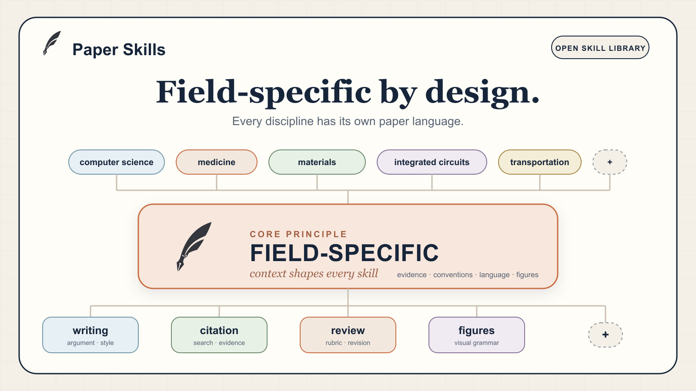

<div align="center">
  <h1>Paper Skills</h1>
  <p><strong>Journal-ready AI skills for every research discipline.</strong></p>
  <p>
    A public skill library for writing, citations, review, venue conventions,
    and field-specific scientific figures.
  </p>
  <p>
    <a href="README.zh.md">中文</a>
    · <a href="ACKNOWLEDGEMENTS.md">Acknowledgements</a>
    · <a href="docs/academic-skill-pack-survey.md">Survey</a>
    · <a href="integrations/catalog.md">Integration Catalog</a>
  </p>
  <p>
    <a href="https://github.com/MisterBrookT/paper-skills/stargazers"></a>
    <a href="https://github.com/MisterBrookT/paper-skills"></a>
    <a href="https://github.com/MisterBrookT/paper-skills"></a>
    <a href="LICENSE"></a>
  </p>
</div>



## What It Is

Paper Skills is an agent-readable skill library for the work around research
papers: drafting, polishing, citations, reviewer response, venue expectations,
and scientific figures.

The project starts from a practical observation: every discipline has its own
paper language. That language is not only prose. It includes evidence patterns,
reference habits, review standards, figure grammar, and venue-specific taste.

## Skill Areas

| Area | What it should cover | Current state |
| --- | --- | --- |
| `writing` | Polishing, translation, restructuring, and argument repair. | scaffold |
| `citation` | Literature search, reference checks, citation audit, and exports. | scaffold |
| `review` | Reviewer simulation, rebuttal letters, revision QA, and response workflows. | scaffold |
| `venue-packs` | Journal-, conference-, and discipline-specific conventions. | scaffold |
| `plot` | Field-specific scientific figures and editable figure skills. | seed cases |

## Why This Repository Exists

Many academic skill packs already solve parts of the workflow. Paper Skills is
not trying to rebuild all of them from scratch. The first goal is to curate,
acknowledge, and interoperate with strong public work.

The first first-party focus is `plot`: field-specific scientific figures. A
materials figure, a medical figure, a traffic figure, an integrated-circuit
schematic, and a computer-science system diagram should not share one generic
diagram recipe. They need domain packs.

## `plot`: Field-Specific Figures

Initial domain seeds:

| Domain | Path | Figure families |
| --- | --- | --- |
| Integrated circuits | [`skills/plot/domains/integrated-circuits`](skills/plot/domains/integrated-circuits) | analog schematics, switched-capacitor figures, circuit architecture |
| Computer science | [`skills/plot/domains/computer-science`](skills/plot/domains/computer-science) | system diagrams, model architecture, pipelines, evaluation setup |

Planned community directions include materials science, medicine and
biomedicine, traffic and transportation, biology, and finance.

## Repository Layout

```text
skills/
  writing/
  citation/
  review/
  venue-packs/
  plot/
    domains/
      integrated-circuits/
      computer-science/
integrations/
  catalog.md
docs/
  academic-skill-pack-survey.md
registry.yaml
```

## Install

No stable install path yet. This repository is still a public scaffold.

For now, use the skills by referencing the relevant `SKILL.md` or README files
directly from an agent session.

## Integration Policy

Paper Skills will prefer adapters and references before vendoring external
skills. If upstream content is copied or modified later, it must follow the
upstream license and preserve attribution.

See [ACKNOWLEDGEMENTS.md](ACKNOWLEDGEMENTS.md).

## Roadmap

- Make `plot` demo cases concrete for integrated circuits and computer science.
- Add minimal examples for `writing`, `citation`, `review`, and `venue-packs`.
- Expand the integration catalog with attribution notes and adapter plans.
- Keep upstream attribution and contribution rules explicit as integrations land.
- Add a stable install/update command after the first usable skill set.

## Star History

Live chart by [`star-history/star-history`](https://github.com/star-history/star-history).

<p>
  <a href="https://www.star-history.com/?type=date&repos=MisterBrookT%2Fpaper-skills">
    
  </a>
</p>

## License

MIT. External skill integrations still need their own license checks and
attribution.
