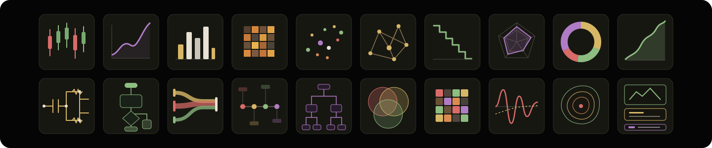

<div align="center">

# ZeroPlot

### Plot anything. From zero.

把意图、数据或参考素材变成可编辑视觉产物。

[](https://github.com/blackblue-labs/zeroplot)
[](skills/zeroplot)
[](LICENSE)
[](https://github.com/blackblue-labs)

[English](README.md)

</div>



## 一个视觉系统，覆盖所有格式

ZeroPlot 是用于创建与重构结构化视觉的 Agent Skill。
从你想表达什么开始，不要求你先学会某个绘图工具。

```text
意图 / 数据 / 参考素材
          ↓
       视觉规范
          ↓
图表 · 图解 · 插图 · 海报 · Slides
          ↓
      可编辑源文件 + 导出
```

`plot` 指组织视觉元素，不只指统计绘图。

## 能做什么

| 产物 | 常见输入 | 优先输出 |
| --- | --- | --- |
| 图表 | 数据集、指标、表格 | matplotlib、SVG、PDF、PNG |
| 图解 | 系统描述、代码、草图 | draw.io、SVG、Mermaid |
| 技术插图 | 论文、网表、截图、领域规范 | TikZ、SVG、draw.io |
| 海报 | 叙事、图片、品牌约束 | PPTX、SVG、PDF |
| Slides | 大纲、证据、已有 deck | PPTX、结构化 slide source |

科研图是第一个验证场，不是产品边界。

## 核心契约

1. **意图优先**：从意义与约束开始。
2. **结构保真**：实体、关系、数据可以审计。
3. **默认可编辑**：优先交付源格式，不把一切压平为图片。
4. **领域感知**：不同学科、受众使用不同视觉语法。

## 安装

```bash
npx skills add blackblue-labs/zeroplot -g -a codex -y
```

也可把 [`skills/zeroplot`](skills/zeroplot) 复制到 Agent skill 目录。

## 试一下

```text
用 ZeroPlot 把这个 CSV 做成可编辑、可发表的图表。

把这张截图重建成可编辑的 draw.io 系统图。

把这份技术报告变成五页视觉叙事 Slides。
```

## 初始领域包

| 领域 | 覆盖 | 状态 |
| --- | --- | --- |
| [集成电路](skills/zeroplot/domains/integrated-circuits) | 原理图、开关电容图、架构块图 | seed |
| [计算机科学](skills/zeroplot/domains/computer-science) | 系统、模型、pipeline、评测结构 | seed |

## 路线

- 图表、图解、原理图生成
- 参考图重建为可编辑结构
- 海报与 Slides 工作流
- 领域 rubric 与独立视觉 benchmark
- 生成 → 编辑 → 导出闭环

## License

MIT。由 [Black Blue Labs](https://github.com/blackblue-labs) 构建。
