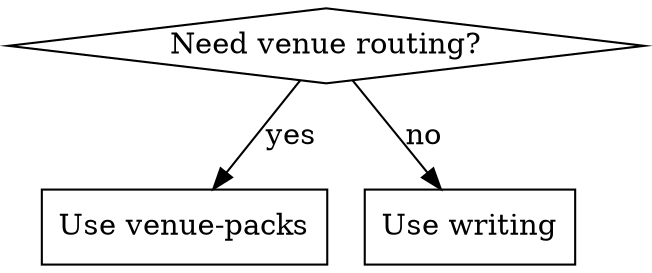

# Paper Skills Skill Schema

日期：2026-07-08

## 目标

Paper Skills 的 skill 要像 `superpowers` 一样可被 agent 稳定读取、路由和执行。

不是写长教程。是写可复用执行规约。

本地来源优先级：

1. `/Users/tangyinghao/workspace/my-agent-config/skills/authoring-skills/SKILL.md`
2. `superpowers:writing-skills`
3. 系统 `skill-creator`

`authoring-skills` 是最贴近本仓库的版本：plain markdown、一个顶层 `SKILL.md`、description 只写触发、跨 Claude/Codex/OpenCode。

## 根结构

安装单元 = 一个含顶层 `SKILL.md` 的目录。

推荐结构：

```text
skills/<skill-name>/
  SKILL.md                  # 必须；唯一入口
  agents/openai.yaml         # 可选；UI 名称和短描述
  README.md                  # 可选；给人看的说明，非 agent 必读
  CREATION-LOG.md            # 可选；核心 skill 的测试/迭代记录
  *-prompt.md                # 可选；subagent / reviewer prompt
  *.md                       # 可选；同目录轻量 supporting docs
  *.dot                      # 可选；Graphviz 规范或图
  scripts/                   # 可选；可执行工具
  references/                # 可选；重参考资料
  examples/                  # 可选；长例子
```

默认用同目录 supporting files。只有文件很多或很重时才建 `references/`、`scripts/`、`examples/`。

当前 `skills/plot/domains/*` 是 `plot` 的 domain references，不是独立可发现 skill。若某个 domain 要独立触发，应提升成：

```text
skills/plot-integrated-circuits/SKILL.md
skills/plot-computer-science/SKILL.md
```

## Frontmatter

只放必要字段：

```yaml
---
name: <kebab-case-name>
description: Use when [trigger symptoms, user intents, task contexts].
---
```

规则：

- `name` 与目录名一致，`[a-z0-9-]`。
- `description` 写触发条件，不写 workflow 摘要。
- 以 `Use when` 开头，加入中英文触发词。
- 不写“先做 A 再做 B”的流程，避免 agent 只读描述不读正文。

## SKILL.md 推荐骨架

```md
---
name: <skill-name>
description: >-
  Use when ...
---

# <Skill Name>

## Overview

1-2 句。说明核心原则。

## When to Use

用症状/场景写。决策复杂时加 `dot` flowchart。

## Core Pattern

关键流程、判断表、合同。

## Required Reads

列出必须读的同目录文件或 `references/` 文件。不要让 agent 猜。

## Output Contract

规定输出形态：表、图 spec、rubric、文件、checklist。

## Source / License Rules

外部内容复制规则、署名、官方来源优先。

## Common Mistakes

列出会导致结果不可用的错误。
```

## agents/openai.yaml

来自本地 `skill-creator` 规范。用于 UI，不替代 `SKILL.md`。

```yaml
interface:
  display_name: "Paper Skill"
  short_description: "Short UI-facing description"
  default_prompt: "Use $paper-skill to ..."
```

只写必要字段。`default_prompt` 必须显式包含 `$skill-name`。

## Supporting Files

| 文件 | 用途 |
| --- | --- |
| `*-prompt.md` | subagent / reviewer prompt |
| `condition-or-pattern.md` | 过长模式说明 |
| `CREATION-LOG.md` | 记录 baseline failure、修改、验证 |
| `scripts/*.py` / `*.sh` | 可重复执行、需要稳定性的工具 |
| `references/*.md` | 官方规则、领域 rubrics、长 reference |
| `examples/*.md` | 长 demo，不放进主入口 |

## Flowchart

复杂决策用 `dot`，不默认用 Mermaid。



约定：

- `diamond`：判断；
- `box`：动作；
- `ellipse`：状态；
- `octagon`：STOP / warning；
- `doublecircle`：入口/出口。

## 本地创建方式

先读本地规约：

```sh
sed -n '1,220p' /Users/tangyinghao/workspace/my-agent-config/skills/authoring-skills/SKILL.md
```

优先使用本机系统 skill creator：

```sh
uv run --with pyyaml python /Users/tangyinghao/.codex/skills/.system/skill-creator/scripts/init_skill.py <skill-name> --path skills --resources references,scripts
```

生成后按本规范改写：

- 删除模板废话；
- description 改成触发条件；
- 加 `agents/openai.yaml`；
- 根据需要加同目录 prompt/reference/script；
- 保持 plain markdown，不使用 Claude-only `@import`；
- 保持一个顶层 `SKILL.md`，嵌套目录只是按需读取的材料；
- 用 `quick_validate.py` 验证 frontmatter。

```sh
uv run --with pyyaml python /Users/tangyinghao/.codex/skills/.system/skill-creator/scripts/quick_validate.py skills/<skill-name>
```

## Copy / Adapt Checklist

- [ ] Source project and exact path recorded.
- [ ] License compatible with MIT repo.
- [ ] Attribution added.
- [ ] Modified content marked if required.
- [ ] No raw tokens, API keys, or personal data.
- [ ] Official source wins over copied skill text.

## Test Level

| Skill Type | Validation |
| --- | --- |
| lightweight adapter | read-through + one demo prompt |
| venue / domain pack | one realistic manuscript scenario |
| core discipline skill | superpowers-style pressure test |
| script-backed skill | run script on sample input |

核心 skill 才用 superpowers 的 RED/GREEN/REFACTOR 压力测试。普通 adapter 不强制。
